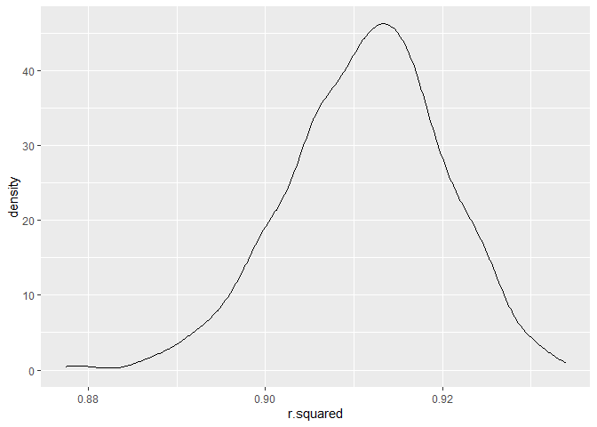
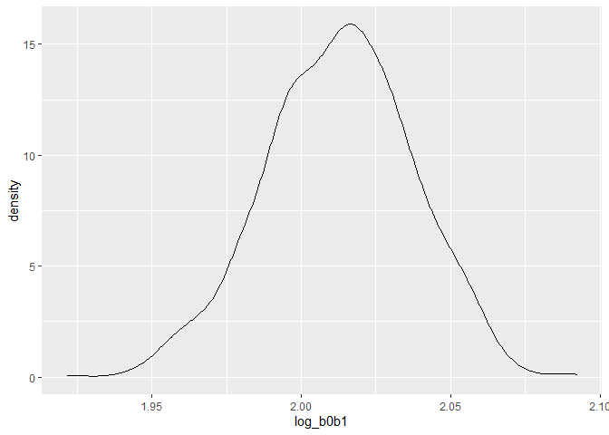
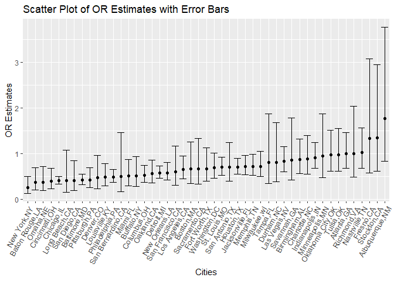
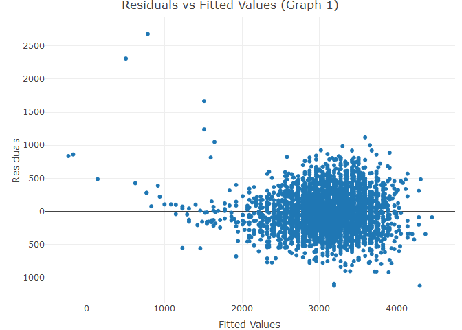
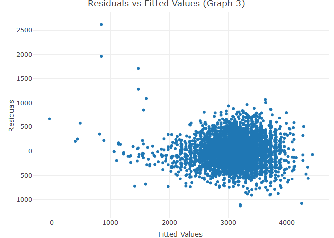
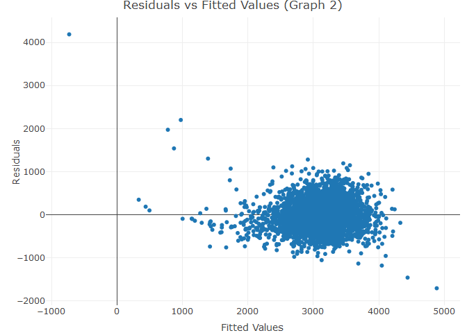
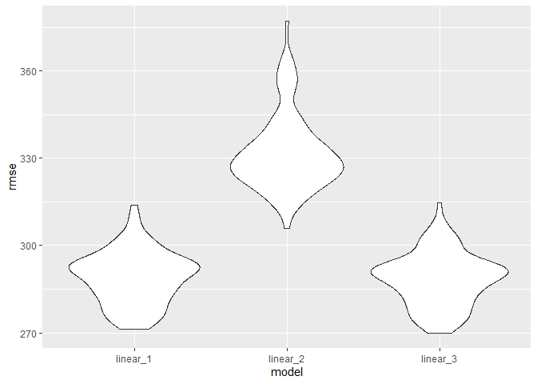
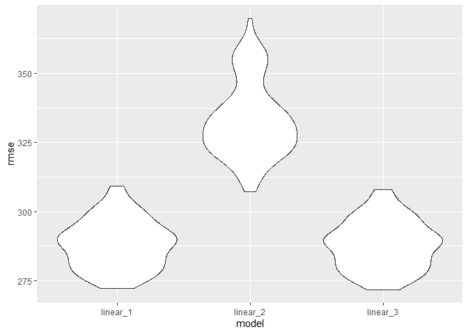

p8105_hw6_hg2596
================
2022-11-29

``` r
library(tidyverse)
```

    ## ── Attaching packages ─────────────────────────────────────── tidyverse 1.3.2 ──
    ## ✔ ggplot2 3.3.6      ✔ purrr   0.3.4 
    ## ✔ tibble  3.1.8      ✔ dplyr   1.0.10
    ## ✔ tidyr   1.2.0      ✔ stringr 1.4.1 
    ## ✔ readr   2.1.2      ✔ forcats 0.5.2 
    ## ── Conflicts ────────────────────────────────────────── tidyverse_conflicts() ──
    ## ✖ dplyr::filter() masks stats::filter()
    ## ✖ dplyr::lag()    masks stats::lag()

``` r
library(p8105.datasets)
library(dplyr)
library(corrplot)
```

    ## Warning: package 'corrplot' was built under R version 4.2.2

    ## corrplot 0.92 loaded

``` r
library(plotly)
```

    ## 
    ## Attaching package: 'plotly'
    ## 
    ## The following object is masked from 'package:ggplot2':
    ## 
    ##     last_plot
    ## 
    ## The following object is masked from 'package:stats':
    ## 
    ##     filter
    ## 
    ## The following object is masked from 'package:graphics':
    ## 
    ##     layout

``` r
library(modelr)
library(mgcv)
```

    ## Loading required package: nlme
    ## 
    ## Attaching package: 'nlme'
    ## 
    ## The following object is masked from 'package:dplyr':
    ## 
    ##     collapse
    ## 
    ## This is mgcv 1.8-40. For overview type 'help("mgcv-package")'.

``` r
set.seed(1)
```

### Problem 1

To obtain a distribution for $\hat{r}^2$, we’ll follow basically the
same procedure we used for regression coefficients: draw bootstrap
samples; the a model to each; extract the value I’m concerned with; and
summarize. Here, we’ll use `modelr::bootstrap` to draw the samples and
`broom::glance` to produce `r.squared` values.

``` r
weather_df = 
  rnoaa::meteo_pull_monitors(
    c("USW00094728"),
    var = c("PRCP", "TMIN", "TMAX"), 
    date_min = "2017-01-01",
    date_max = "2017-12-31") %>%
  mutate(
    name = recode(id, USW00094728 = "CentralPark_NY"),
    tmin = tmin / 10,
    tmax = tmax / 10) %>%
  select(name, id, everything())
```

    ## Registered S3 method overwritten by 'hoardr':
    ##   method           from
    ##   print.cache_info httr

    ## using cached file: C:\Users\hilin\AppData\Local/Cache/R/noaa_ghcnd/USW00094728.dly

    ## date created (size, mb): 2022-09-16 20:19:21 (8.419)

    ## file min/max dates: 1869-01-01 / 2022-09-30

``` r
weather_df %>% 
  modelr::bootstrap(n = 1000) %>% 
  mutate(
    models = map(strap, ~lm(tmax ~ tmin, data = .x) ),
    results = map(models, broom::glance)) %>% 
  select(-strap, -models) %>% 
  unnest(results) %>% 
  ggplot(aes(x = r.squared)) + geom_density()
```

<!-- -->

In this example, the $\hat{r}^2$ value is high, and the upper bound at 1
may be a cause for the generally skewed shape of the distribution. If we
wanted to construct a confidence interval for $R^2$, we could take the
2.5% and 97.5% quantiles of the estimates across bootstrap samples.
However, because the shape isn’t symmetric, using the mean +/- 1.96
times the standard error probably wouldn’t work well.

We can produce a distribution for $\log(\beta_0 * \beta1)$ using a
similar approach, with a bit more wrangling before we make our plot.

``` r
weather_df %>% 
  modelr::bootstrap(n = 1000) %>% 
  mutate(
    models = map(strap, ~lm(tmax ~ tmin, data = .x) ),
    results = map(models, broom::tidy)) %>% 
  select(-strap, -models) %>% 
  unnest(results) %>% 
  select(id = `.id`, term, estimate) %>% 
  pivot_wider(
    names_from = term, 
    values_from = estimate) %>% 
  rename(beta0 = `(Intercept)`, beta1 = tmin) %>% 
  mutate(log_b0b1 = log(beta0 * beta1)) %>% 
  ggplot(aes(x = log_b0b1)) + geom_density()
```

<!-- -->

As with $r^2$, this distribution is somewhat skewed and has some
outliers.

The point of this is not to say you should always use the bootstrap –
it’s possible to establish “large sample” distributions for strange
parameters / values / summaries in a lot of cases, and those are great
to have. But it is helpful to know that there’s a way to do inference
even in tough cases.

# Problem 2

``` r
homicide_1= read_csv("./data/homicide_data.csv", show_col_types = FALSE)
```

# Creating a City State Variable

``` r
homicide_1 = homicide_1 %>%
  unite('city_state', city:state, remove = FALSE) %>% 
  apply(., 2, function(city_state) as.character(gsub("_", ",", city_state))) 
```

The homicide raw data has 52179 observations and 13 variables.

# Cleaning Data and Resolved Variable

``` r
homicide_2 = as_tibble(homicide_1) %>%
  janitor::clean_names() %>%
  mutate(victim_age = as.numeric(victim_age)) %>%
  mutate(lat = as.numeric(lat)) %>%
  mutate(lon = as.numeric(lon)) %>%
  mutate(status = ifelse(disposition%in%c("Closed by arrest"), 1, 0))
```

    ## Warning in mask$eval_all_mutate(quo): NAs introduced by coercion

# Clean up Data

``` r
homicide_3 = 
  homicide_2 %>%
  mutate(omitt = ifelse(city_state%in%c("Dallas,TX","Phoenix,AZ","Kansas City,MO","Tulsa,AL"), 0, 1)) %>%
  filter(omitt == 1) %>%
  filter(victim_race %in% c("White","Black")) %>%
  arrange(status)
```

# Logisitic Regression for Baltimore

``` r
fit_logistic = 
  homicide_3 %>% 
  filter(city_state == "Baltimore,MD") %>%
  glm(status ~ victim_age + victim_sex + victim_race, data = ., family = binomial()) 
```

# Table for OR and CI for Baltimore

``` r
fit_logistic %>% 
  broom::tidy() %>% 
  mutate(OR = exp(estimate), 
         CI_Lower = exp((estimate) - 1.96*(std.error)),
         CI_Upper = exp((estimate) + 1.96*(std.error))) %>%
  filter(term == "victim_sexMale") %>%
  select(term, OR, CI_Lower, CI_Upper, p.value) %>%
  knitr::kable(digits = 3)
```

| term           |    OR | CI_Lower | CI_Upper | p.value |
|:---------------|------:|---------:|---------:|--------:|
| victim_sexMale | 0.426 |    0.325 |    0.558 |       0 |

\#Filter out Vicitm Sex ‘Unknown’

``` r
homicide_4 = 
  homicide_3 %>%
  filter(victim_sex %in% c("Female","Male"))
```

# Map Over all Cities

``` r
fit_over_cities = 
  homicide_4 %>%
  nest(data = -city_state) %>%
  mutate(
    models = map(data, ~glm(status ~ victim_age + victim_sex + victim_race, data = .x, family = binomial())),
                 outcome = map(models,broom::tidy,conf.int = TRUE)) %>%
      unnest(cols = outcome) %>%
      mutate(OR = exp(estimate), 
         CI_Lower = exp((estimate) - 1.96*(std.error)),
         CI_Upper = exp((estimate) + 1.96*(std.error))) %>%
   select(city_state, term, log_OR = estimate, OR, CI_Lower, CI_Upper, p.value) %>%
  filter(term == "victim_sexMale") %>%
  select(city_state,term,OR, CI_Lower, CI_Upper)
```

# Table of OR and CI for all Cities

``` r
final = 
  fit_over_cities %>%
   knitr::kable(digits = 3)

final
```

| city_state        | term           |    OR | CI_Lower | CI_Upper |
|:------------------|:---------------|------:|---------:|---------:|
| Albuquerque,NM    | victim_sexMale | 1.767 |    0.831 |    3.761 |
| Atlanta,GA        | victim_sexMale | 1.000 |    0.684 |    1.463 |
| Baltimore,MD      | victim_sexMale | 0.426 |    0.325 |    0.558 |
| Baton Rouge,LA    | victim_sexMale | 0.381 |    0.209 |    0.695 |
| Birmingham,AL     | victim_sexMale | 0.870 |    0.574 |    1.318 |
| Boston,MA         | victim_sexMale | 0.667 |    0.354 |    1.260 |
| Buffalo,NY        | victim_sexMale | 0.521 |    0.290 |    0.935 |
| Charlotte,NC      | victim_sexMale | 0.884 |    0.557 |    1.403 |
| Chicago,IL        | victim_sexMale | 0.410 |    0.336 |    0.501 |
| Cincinnati,OH     | victim_sexMale | 0.400 |    0.236 |    0.677 |
| Columbus,OH       | victim_sexMale | 0.532 |    0.378 |    0.750 |
| Denver,CO         | victim_sexMale | 0.479 |    0.236 |    0.971 |
| Detroit,MI        | victim_sexMale | 0.582 |    0.462 |    0.734 |
| Durham,NC         | victim_sexMale | 0.812 |    0.392 |    1.683 |
| Fort Worth,TX     | victim_sexMale | 0.669 |    0.397 |    1.127 |
| Fresno,CA         | victim_sexMale | 1.335 |    0.580 |    3.071 |
| Houston,TX        | victim_sexMale | 0.711 |    0.558 |    0.907 |
| Indianapolis,IN   | victim_sexMale | 0.919 |    0.679 |    1.242 |
| Jacksonville,FL   | victim_sexMale | 0.720 |    0.537 |    0.966 |
| Las Vegas,NV      | victim_sexMale | 0.837 |    0.608 |    1.154 |
| Long Beach,CA     | victim_sexMale | 0.410 |    0.156 |    1.082 |
| Los Angeles,CA    | victim_sexMale | 0.662 |    0.458 |    0.956 |
| Louisville,KY     | victim_sexMale | 0.491 |    0.305 |    0.790 |
| Memphis,TN        | victim_sexMale | 0.723 |    0.529 |    0.988 |
| Miami,FL          | victim_sexMale | 0.515 |    0.304 |    0.872 |
| Milwaukee,wI      | victim_sexMale | 0.727 |    0.499 |    1.060 |
| Minneapolis,MN    | victim_sexMale | 0.947 |    0.478 |    1.875 |
| Nashville,TN      | victim_sexMale | 1.034 |    0.685 |    1.562 |
| New Orleans,LA    | victim_sexMale | 0.585 |    0.422 |    0.811 |
| New York,NY       | victim_sexMale | 0.262 |    0.138 |    0.499 |
| Oakland,CA        | victim_sexMale | 0.563 |    0.365 |    0.868 |
| Oklahoma City,OK  | victim_sexMale | 0.974 |    0.624 |    1.520 |
| Omaha,NE          | victim_sexMale | 0.382 |    0.203 |    0.721 |
| Philadelphia,PA   | victim_sexMale | 0.496 |    0.378 |    0.652 |
| Pittsburgh,PA     | victim_sexMale | 0.431 |    0.265 |    0.700 |
| Richmond,VA       | victim_sexMale | 1.006 |    0.498 |    2.033 |
| San Antonio,TX    | victim_sexMale | 0.705 |    0.398 |    1.249 |
| Sacramento,CA     | victim_sexMale | 0.669 |    0.335 |    1.337 |
| Savannah,GA       | victim_sexMale | 0.867 |    0.422 |    1.780 |
| San Bernardino,CA | victim_sexMale | 0.500 |    0.171 |    1.462 |
| San Diego,CA      | victim_sexMale | 0.413 |    0.200 |    0.855 |
| San Francisco,CA  | victim_sexMale | 0.608 |    0.317 |    1.165 |
| St. Louis,MO      | victim_sexMale | 0.703 |    0.530 |    0.932 |
| Stockton,CA       | victim_sexMale | 1.352 |    0.621 |    2.942 |
| Tampa,FL          | victim_sexMale | 0.808 |    0.348 |    1.876 |
| Tulsa,OK          | victim_sexMale | 0.976 |    0.614 |    1.552 |
| Washington,DC     | victim_sexMale | 0.691 |    0.469 |    1.018 |

# Graph Cities and OR

``` r
graph_p_1 = 
  fit_over_cities %>%
  mutate(city_state = fct_reorder(city_state, OR)) %>%
  ggplot(aes(x = city_state, y = OR)) + 
  geom_point() +
  geom_errorbar(aes(ymin = CI_Lower, ymax = CI_Upper)) + 
  labs(
    title = "Scatter Plot of OR Estimates with Error Bars",
    x = "Cities",
    y = "OR Estimates",
  ) + 
  theme(axis.text.x=element_text(angle=60,vjust = 1, hjust=1,size=10))

graph_p_1  
```

<!-- -->

When we plot **estimated ORs** and **Cls** for each city, what we can
observe that a majority of **OR** are below 1.There are only three
cities that have an **OR** higher than 1 and those are **Fresno**,
**Stockton** and **Albuquerque** so in these cities, a male victim of
homicide has **1.5** times the odds of **the case being solved** then
female victims, after adjusted for victim age and sex. In New York, a
male victim of homicide has about **0.3** times the odds of **the case
being solved** then female victims, after adjusted for victim age and
sex. Whereas, Washington DC, a male victim of homicide has **0.7** times
the odds of **the case being solved** then females victims, after
adjusted for victim age and sex. Therefore, the odds of solving a case
really depends on what city the victim was in, but it does seem to favor
closing female victim cases over male victim cases.

# Problem 3

``` r
birth= read_csv("./data/birthweight.csv", show_col_types = FALSE)
```

# Clean Birth Data

``` r
birth_wt = 
  birth %>%
  janitor::clean_names() %>%
  mutate(babysex = as.factor(babysex),
         frace = as.factor(frace), 
         mrace = as.factor(mrace))
```

# Take away Character Varaibles for the Cor Matrix

``` r
birth_cor =
  birth_wt %>%
  select(-babysex,-frace,-mrace)
```

# Create a Correlation Matrix

``` r
M = cor(birth_cor)
```

    ## Warning in cor(birth_cor): the standard deviation is zero

``` r
corrplot(M, method = 'color', order = 'alphabet')
```

<!-- -->

Based on correlation matrix, the predictors that have the highest
correlation with the outcome **birth weight** are **bhead** and
**blenght**.

``` r
birth_2 = 
  birth_wt %>%
  select(bwt,bhead,blength)
```

# Create Linear Regression

``` r
l1 = 
  lm(bwt ~ bhead + blength, data = birth_2)
```

# Add Residuals and Predictors

``` r
birth_3 = 
  birth_2 %>% 
  add_residuals(l1) %>%
  add_predictions(l1)

birth_3
```

    ## # A tibble: 4,342 × 5
    ##      bwt bhead blength  resid  pred
    ##    <dbl> <dbl>   <dbl>  <dbl> <dbl>
    ##  1  3629    34      51  357.  3272.
    ##  2  3062    34      48   45.5 3017.
    ##  3  3345    36      50 -134.  3479.
    ##  4  3062    34      52 -295.  3357.
    ##  5  3374    34      52   17.3 3357.
    ##  6  3374    33      52  163.  3211.
    ##  7  2523    33      46 -177.  2700.
    ##  8  2778    33      49 -178.  2956.
    ##  9  3515    36      52 -134.  3649.
    ## 10  3459    33      50  418.  3041.
    ## # … with 4,332 more rows

# Graph 1: Plot residuals and fitted values for L1

``` r
graph_1 = 
  birth_3 %>%
  plot_ly(x = ~pred, y = ~resid, type = "scatter", mode = "markers",alpha = 1.2) %>% 
  layout(title = 'Residuals vs Fitted Values (Graph 1)',
         xaxis = list(title = 'Fitted Values'),
         yaxis = list(title = 'Residuals'), 
         legend = list(title=list(text='<b> True Mean Values </b>'))) 

graph_1
```

<!-- -->

# Create Second Linear Regression

``` r
l2 = 
  lm(bwt ~ blength + gaweeks, data = birth_wt)

second_set = 
  birth_wt %>% 
  select(bwt, blength, gaweeks) %>%
  add_residuals(l2) %>%
  add_predictions(l2)

second_set
```

    ## # A tibble: 4,342 × 5
    ##      bwt blength gaweeks  resid  pred
    ##    <dbl>   <dbl>   <dbl>  <dbl> <dbl>
    ##  1  3629      51    39.9  341.  3288.
    ##  2  3062      48    25.9  538.  2524.
    ##  3  3345      50    39.9  186.  3159.
    ##  4  3062      52    40   -357.  3419.
    ##  5  3374      52    41.6  -88.4 3462.
    ##  6  3374      52    40.7  -64.0 3438.
    ##  7  2523      46    40.3 -133.  2656.
    ##  8  2778      49    37.4 -185.  2963.
    ##  9  3515      52    40.3   87.8 3427.
    ## 10  3459      50    40.7  278.  3181.
    ## # … with 4,332 more rows

# Graph 2: Plot residuals and fitted values for L2

``` r
graph_2 = 
  second_set %>%
  plot_ly(x = ~pred, y = ~resid, type = "scatter", mode = "markers",alpha = 1.2) %>% 
  layout(title = 'Residuals vs Fitted Values (Graph 2)',
         xaxis = list(title = 'Fitted Values'),
         yaxis = list(title = 'Residuals'), 
         legend = list(title=list(text='<b> True Mean Values </b>'))) 

graph_2
```

<!-- -->

# Create Third Linear Regression

``` r
l3 = 
  lm(bwt ~ bhead + blength + babysex + bhead*blength + bhead*babysex + blength*babysex + bhead*blength*babysex, data = birth_wt)

third_set = 
  birth_wt %>% 
  select(bwt,bhead,blength,babysex) %>%
  add_residuals(l3) %>%
  add_predictions(l3)

third_set
```

    ## # A tibble: 4,342 × 6
    ##      bwt bhead blength babysex  resid  pred
    ##    <dbl> <dbl>   <dbl> <fct>    <dbl> <dbl>
    ##  1  3629    34      51 2        335.  3294.
    ##  2  3062    34      48 1         59.2 3003.
    ##  3  3345    36      50 2       -157.  3502.
    ##  4  3062    34      52 1       -274.  3336.
    ##  5  3374    34      52 2        -11.8 3386.
    ##  6  3374    33      52 1        191.  3183.
    ##  7  2523    33      46 2       -178.  2701.
    ##  8  2778    33      49 2       -187.  2965.
    ##  9  3515    36      52 1       -127.  3642.
    ## 10  3459    33      50 1        444.  3015.
    ## # … with 4,332 more rows

# Graph 3: Plot residuals and fitted values for L3

``` r
graph_3 = 
  third_set %>%
  plot_ly(x = ~pred, y = ~resid, type = "scatter", mode = "markers",alpha = 1.2) %>% 
  layout(title = 'Residuals vs Fitted Values (Graph 3)',
         xaxis = list(title = 'Fitted Values'),
         yaxis = list(title = 'Residuals'), 
         legend = list(title=list(text='<b> True Mean Values </b>'))) 

graph_3
```

<!-- -->

# Check with Cross Validation

``` r
cv_df =
  crossv_mc(birth_wt, 100)
```

``` r
cv_df =
  cv_df %>% 
  mutate(
    train = map(train, as_tibble),
    test = map(test, as_tibble))
```

``` r
cv_df = 
  cv_df %>% 
  mutate(
    linear_m  = map(train, ~lm(bwt ~ bhead + blength, data = .x)),
    linear_m2 = map(train, ~lm(bwt ~ blength + gaweeks, data = .x)),
    linear_m3 = map(train, ~lm(bwt ~ bhead + blength + babysex + bhead*blength + bhead*babysex + blength*babysex + bhead*blength*babysex, data = .x))) %>% 
  mutate(
    rmse_linear_1 = map2_dbl(linear_m, test, ~rmse(model = .x, data = .y)),
    rmse_linear_2    = map2_dbl(linear_m2, test, ~rmse(model = .x, data = .y)),
    rmse_linear_3 = map2_dbl(linear_m3, test, ~rmse(model = .x, data = .y)))

cv_df
```

    ## # A tibble: 100 × 9
    ##    train    test     .id   linear_m linear_m2 linear_m3 rmse_l…¹ rmse_…² rmse_…³
    ##    <list>   <list>   <chr> <list>   <list>    <list>       <dbl>   <dbl>   <dbl>
    ##  1 <tibble> <tibble> 001   <lm>     <lm>      <lm>          297.    349.    297.
    ##  2 <tibble> <tibble> 002   <lm>     <lm>      <lm>          298.    335.    297.
    ##  3 <tibble> <tibble> 003   <lm>     <lm>      <lm>          289.    324.    290.
    ##  4 <tibble> <tibble> 004   <lm>     <lm>      <lm>          296.    351.    299.
    ##  5 <tibble> <tibble> 005   <lm>     <lm>      <lm>          283.    327.    283.
    ##  6 <tibble> <tibble> 006   <lm>     <lm>      <lm>          286.    322.    287.
    ##  7 <tibble> <tibble> 007   <lm>     <lm>      <lm>          282.    330.    281.
    ##  8 <tibble> <tibble> 008   <lm>     <lm>      <lm>          295.    332.    294.
    ##  9 <tibble> <tibble> 009   <lm>     <lm>      <lm>          277.    328.    278.
    ## 10 <tibble> <tibble> 010   <lm>     <lm>      <lm>          281.    328.    281.
    ## # … with 90 more rows, and abbreviated variable names ¹​rmse_linear_1,
    ## #   ²​rmse_linear_2, ³​rmse_linear_3

# Show the RMSE

``` r
cv_df %>% 
  select(starts_with("rmse")) %>% 
  pivot_longer(
    everything(),
    names_to = "model", 
    values_to = "rmse",
    names_prefix = "rmse_") %>% 
  mutate(model = fct_inorder(model)) %>% 
  ggplot(aes(x = model, y = rmse)) + geom_violin()
```

<!-- -->

It’s important to note that **low RMSE** values are what help show if a
model is a good fit. In our violin graph, it shows how **linear
regression 1** and the **third regression** had similar range for rmse
and were the lowest compared to the **second linear regression**.This
goes to show that **including all the interaction terms** in the **third
linear regression** were helpful in predicting the model compared to
**length at birth** and **gestational age** which were not as good as a
fit.It also makes since that the first model I created had a low RMSE
because I knew that my predictors **blength** and **bhead** were
**highly associated** with the outcome, therefore better at predicting
the model.
