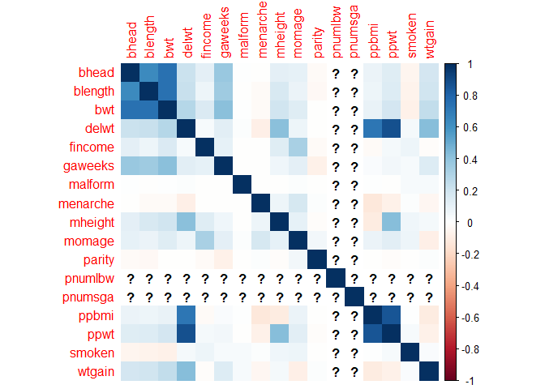

p8105_hw6_hg2596
================
2022-11-29

``` r
library(tidyverse)
```

    ## ── Attaching packages ─────────────────────────────────────── tidyverse 1.3.2 ──
    ## ✔ ggplot2 3.3.6      ✔ purrr   0.3.4 
    ## ✔ tibble  3.1.8      ✔ dplyr   1.0.10
    ## ✔ tidyr   1.2.0      ✔ stringr 1.4.1 
    ## ✔ readr   2.1.2      ✔ forcats 0.5.2 
    ## ── Conflicts ────────────────────────────────────────── tidyverse_conflicts() ──
    ## ✖ dplyr::filter() masks stats::filter()
    ## ✖ dplyr::lag()    masks stats::lag()

``` r
library(p8105.datasets)
library(dplyr)
library(corrplot)
```

    ## Warning: package 'corrplot' was built under R version 4.2.2

    ## corrplot 0.92 loaded

``` r
library(plotly)
```

    ## 
    ## Attaching package: 'plotly'
    ## 
    ## The following object is masked from 'package:ggplot2':
    ## 
    ##     last_plot
    ## 
    ## The following object is masked from 'package:stats':
    ## 
    ##     filter
    ## 
    ## The following object is masked from 'package:graphics':
    ## 
    ##     layout

``` r
library(modelr)
library(mgcv)
```

    ## Loading required package: nlme
    ## 
    ## Attaching package: 'nlme'
    ## 
    ## The following object is masked from 'package:dplyr':
    ## 
    ##     collapse
    ## 
    ## This is mgcv 1.8-40. For overview type 'help("mgcv-package")'.

``` r
set.seed(1)
```

# Problem 2

``` r
homicide_1= read_csv("./data/homicide_data.csv", show_col_types = FALSE)
```

# Creating a City State Variable

``` r
homicide_1 = homicide_1 %>%
  unite('city_state', city:state, remove = FALSE) %>% 
  apply(., 2, function(city_state) as.character(gsub("_", ",", city_state))) 
```

The homicide raw data has 52179 observations and 13 variables. Key
variables are **uid** which gives a unique ID to each homicide victim
and the **city**, **state** in which the killing took place. Another
important variable is the **deposition** which describes the status of
the case for examples is it closed with an arrest or possibly still open
with no arrest.

# Cleaning Data and Creating Status Variable

``` r
homicide_2 = as_tibble(homicide_1) %>%
  janitor::clean_names() %>%
  mutate(victim_age = as.numeric(victim_age)) %>%
  mutate(lat = as.numeric(lat)) %>%
  mutate(lon = as.numeric(lon)) %>%
  mutate(status = ifelse(disposition%in%c("Closed by arrest"), 1, 0))
```

    ## Warning in mask$eval_all_mutate(quo): NAs introduced by coercion

# omit variable and Filter Out and Race

``` r
homicide_3 = 
  homicide_2 %>%
  mutate(omitt = ifelse(city_state%in%c("Dallas,TX","Phoenix,AZ","Kansas City,MO","Tulsa,AL"), 0, 1)) %>%
  filter(omitt == 1) %>%
  filter(victim_race %in% c("White","Black")) %>%
  arrange(status)
```

# Filter out Baltimore and Logisitic Reg

``` r
fit_logistic = 
  homicide_3 %>% 
  filter(city_state == "Baltimore,MD") %>%
  glm(status ~ victim_age + victim_sex + victim_race, data = ., family = binomial()) 
```

``` r
fit_logistic %>% 
  broom::tidy() %>% 
  mutate(OR = exp(estimate), 
         CI_Lower = exp((estimate) - 1.96*(std.error)),
         CI_Upper = exp((estimate) + 1.96*(std.error))) %>%
  select(term, log_OR = estimate, OR, CI_Lower, CI_Upper, p.value) %>%
  knitr::kable(digits = 3)
```

| term             | log_OR |    OR | CI_Lower | CI_Upper | p.value |
|:-----------------|-------:|------:|---------:|---------:|--------:|
| (Intercept)      |  0.310 | 1.363 |    0.975 |    1.907 |   0.070 |
| victim_age       | -0.007 | 0.993 |    0.987 |    1.000 |   0.043 |
| victim_sexMale   | -0.854 | 0.426 |    0.325 |    0.558 |   0.000 |
| victim_raceWhite |  0.842 | 2.320 |    1.648 |    3.268 |   0.000 |

\#Filter out Vicitm Sex Unknown

``` r
homicide_4 = 
  homicide_3 %>%
  filter(victim_sex %in% c("Female","Male"))
```

# Map over cities

``` r
fit_over_cities = 
  homicide_4 %>%
  nest(data = -city_state) %>%
  mutate(
    models = map(data, ~glm(status ~ victim_age + victim_sex + victim_race, data = .x, family = binomial()) %>% broom::tidy()%>%
         mutate(OR = exp(estimate), 
         CI_Lower = exp((estimate) - 1.96*(std.error)),
         CI_Upper = exp((estimate) + 1.96*(std.error))) %>%
  filter(term == "victim_sexMale") %>%
  select(term, OR, CI_Lower, CI_Upper, p.value) %>%
  knitr::kable(digits = 3))) %>%
  unnest(models) %>%
  select(-data) 


fit_over_cities
```

    ## # A tibble: 141 × 2
    ##    city_state     models                                               
    ##    <chr>          <kntr_kbl>                                           
    ##  1 Albuquerque,NM |term           |    OR| CI_Lower| CI_Upper| p.value|
    ##  2 Albuquerque,NM |:--------------|-----:|--------:|--------:|-------:|
    ##  3 Albuquerque,NM |victim_sexMale | 1.767|    0.831|    3.761|   0.139|
    ##  4 Atlanta,GA     |term           | OR| CI_Lower| CI_Upper| p.value|   
    ##  5 Atlanta,GA     |:--------------|--:|--------:|--------:|-------:|   
    ##  6 Atlanta,GA     |victim_sexMale |  1|    0.684|    1.463|       1|   
    ##  7 Baltimore,MD   |term           |    OR| CI_Lower| CI_Upper| p.value|
    ##  8 Baltimore,MD   |:--------------|-----:|--------:|--------:|-------:|
    ##  9 Baltimore,MD   |victim_sexMale | 0.426|    0.325|    0.558|       0|
    ## 10 Baton Rouge,LA |term           |    OR| CI_Lower| CI_Upper| p.value|
    ## # … with 131 more rows

# Problem 3

``` r
birth= read_csv("./data/birthweight.csv", show_col_types = FALSE)
```

# Clean Data

``` r
birth_wt = 
  birth %>%
  janitor::clean_names() %>%
  mutate(babysex = as.factor(babysex),
         frace = as.factor(frace), 
         mrace = as.factor(mrace))
```

# Take away Character Varaibles for the Cor Matrix

``` r
birth_cor =
  birth_wt %>%
  select(-babysex,-frace,-mrace)
```

# Create a Correlation Matrix

``` r
M = cor(birth_cor)
```

    ## Warning in cor(birth_cor): the standard deviation is zero

``` r
corrplot(M, method = 'color', order = 'alphabet')
```

<!-- -->

Based on correlation matrix, the predictors that have the highest
correlation with the outcome **birth weight** are **bhead** and
**blenght**.

``` r
birth_2 = 
  birth_wt %>%
  select(bwt,bhead,blength)
```

# Create Linear Regression

``` r
l1 = 
  lm(bwt ~ bhead + blength, data = birth_2)
```

# Add Residuals and Predictors

``` r
birth_3 = 
  birth_2 %>% 
  add_residuals(l1) %>%
  add_predictions(l1)

birth_3
```

    ## # A tibble: 4,342 × 5
    ##      bwt bhead blength  resid  pred
    ##    <dbl> <dbl>   <dbl>  <dbl> <dbl>
    ##  1  3629    34      51  357.  3272.
    ##  2  3062    34      48   45.5 3017.
    ##  3  3345    36      50 -134.  3479.
    ##  4  3062    34      52 -295.  3357.
    ##  5  3374    34      52   17.3 3357.
    ##  6  3374    33      52  163.  3211.
    ##  7  2523    33      46 -177.  2700.
    ##  8  2778    33      49 -178.  2956.
    ##  9  3515    36      52 -134.  3649.
    ## 10  3459    33      50  418.  3041.
    ## # … with 4,332 more rows

# Plot residuals and fitted values for L1

``` r
graph_1 = 
  birth_3 %>%
  plot_ly(x = ~pred, y = ~resid, type = "scatter", mode = "markers",alpha = 1.2) %>% 
  layout(title = 'Residuals vs Fitted Values (Graph 1)',
         xaxis = list(title = 'Fitted Values'),
         yaxis = list(title = 'Residuals'), 
         legend = list(title=list(text='<b> True Mean Values </b>'))) 

graph_1
```

<!-- -->

# Create Second Linear Regression

``` r
l2 = 
  lm(bwt ~ blength + gaweeks, data = birth_wt)

second_set = 
  birth_wt %>% 
  select(bwt, blength, gaweeks) %>%
  add_residuals(l2) %>%
  add_predictions(l2)

second_set
```

    ## # A tibble: 4,342 × 5
    ##      bwt blength gaweeks  resid  pred
    ##    <dbl>   <dbl>   <dbl>  <dbl> <dbl>
    ##  1  3629      51    39.9  341.  3288.
    ##  2  3062      48    25.9  538.  2524.
    ##  3  3345      50    39.9  186.  3159.
    ##  4  3062      52    40   -357.  3419.
    ##  5  3374      52    41.6  -88.4 3462.
    ##  6  3374      52    40.7  -64.0 3438.
    ##  7  2523      46    40.3 -133.  2656.
    ##  8  2778      49    37.4 -185.  2963.
    ##  9  3515      52    40.3   87.8 3427.
    ## 10  3459      50    40.7  278.  3181.
    ## # … with 4,332 more rows

# Graph 2

``` r
graph_2 = 
  second_set %>%
  plot_ly(x = ~pred, y = ~resid, type = "scatter", mode = "markers",alpha = 1.2) %>% 
  layout(title = 'Residuals vs Fitted Values (Graph 2)',
         xaxis = list(title = 'Fitted Values'),
         yaxis = list(title = 'Residuals'), 
         legend = list(title=list(text='<b> True Mean Values </b>'))) 

graph_2
```

<!-- -->

# Create Third Linear Regression

``` r
l3 = 
  lm(bwt ~ bhead + blength + babysex + bhead*blength + bhead*babysex + blength*babysex + bhead*blength*babysex, data = birth_wt)

third_set = 
  birth_wt %>% 
  select(bwt,bhead,blength,babysex) %>%
  add_residuals(l3) %>%
  add_predictions(l3)

third_set
```

    ## # A tibble: 4,342 × 6
    ##      bwt bhead blength babysex  resid  pred
    ##    <dbl> <dbl>   <dbl> <fct>    <dbl> <dbl>
    ##  1  3629    34      51 2        335.  3294.
    ##  2  3062    34      48 1         59.2 3003.
    ##  3  3345    36      50 2       -157.  3502.
    ##  4  3062    34      52 1       -274.  3336.
    ##  5  3374    34      52 2        -11.8 3386.
    ##  6  3374    33      52 1        191.  3183.
    ##  7  2523    33      46 2       -178.  2701.
    ##  8  2778    33      49 2       -187.  2965.
    ##  9  3515    36      52 1       -127.  3642.
    ## 10  3459    33      50 1        444.  3015.
    ## # … with 4,332 more rows

# Graph 3

``` r
graph_3 = 
  third_set %>%
  plot_ly(x = ~pred, y = ~resid, type = "scatter", mode = "markers",alpha = 1.2) %>% 
  layout(title = 'Residuals vs Fitted Values (Graph 3)',
         xaxis = list(title = 'Fitted Values'),
         yaxis = list(title = 'Residuals'), 
         legend = list(title=list(text='<b> True Mean Values </b>'))) 

graph_3
```

<!-- -->

# Check with Cross Validation

``` r
cv_df =
  crossv_mc(birth_wt, 100)
```

``` r
cv_df =
  cv_df %>% 
  mutate(
    train = map(train, as_tibble),
    test = map(test, as_tibble))
```

``` r
cv_df = 
  cv_df %>% 
  mutate(
    linear_m  = map(train, ~lm(bwt ~ bhead + blength, data = .x)),
    linear_m2 = map(train, ~lm(bwt ~ blength + gaweeks, data = .x)),
    linear_m3 = map(train, ~lm(bwt ~ bhead + blength + babysex + bhead*blength + bhead*babysex + blength*babysex + bhead*blength*babysex, data = .x))) %>% 
  mutate(
    rmse_linear_1 = map2_dbl(linear_m, test, ~rmse(model = .x, data = .y)),
    rmse_linear_2    = map2_dbl(linear_m2, test, ~rmse(model = .x, data = .y)),
    rmse_linear_3 = map2_dbl(linear_m3, test, ~rmse(model = .x, data = .y)))

cv_df
```

    ## # A tibble: 100 × 9
    ##    train    test     .id   linear_m linear_m2 linear_m3 rmse_l…¹ rmse_…² rmse_…³
    ##    <list>   <list>   <chr> <list>   <list>    <list>       <dbl>   <dbl>   <dbl>
    ##  1 <tibble> <tibble> 001   <lm>     <lm>      <lm>          291.    341.    291.
    ##  2 <tibble> <tibble> 002   <lm>     <lm>      <lm>          301.    365.    299.
    ##  3 <tibble> <tibble> 003   <lm>     <lm>      <lm>          275.    329.    276.
    ##  4 <tibble> <tibble> 004   <lm>     <lm>      <lm>          294.    341.    293.
    ##  5 <tibble> <tibble> 005   <lm>     <lm>      <lm>          294.    323.    292.
    ##  6 <tibble> <tibble> 006   <lm>     <lm>      <lm>          291.    328.    289.
    ##  7 <tibble> <tibble> 007   <lm>     <lm>      <lm>          303.    326.    303.
    ##  8 <tibble> <tibble> 008   <lm>     <lm>      <lm>          276.    319.    274.
    ##  9 <tibble> <tibble> 009   <lm>     <lm>      <lm>          294.    330.    294.
    ## 10 <tibble> <tibble> 010   <lm>     <lm>      <lm>          280.    322.    279.
    ## # … with 90 more rows, and abbreviated variable names ¹​rmse_linear_1,
    ## #   ²​rmse_linear_2, ³​rmse_linear_3

# Show the RMSE

``` r
cv_df %>% 
  select(starts_with("rmse")) %>% 
  pivot_longer(
    everything(),
    names_to = "model", 
    values_to = "rmse",
    names_prefix = "rmse_") %>% 
  mutate(model = fct_inorder(model)) %>% 
  ggplot(aes(x = model, y = rmse)) + geom_violin()
```

<!-- -->
